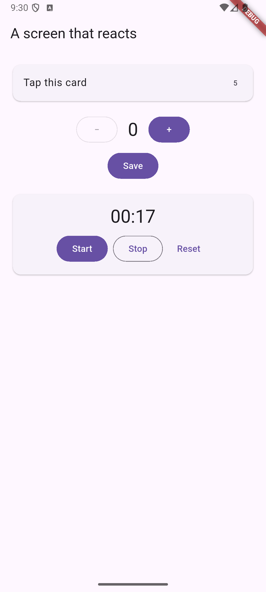

# Practice 4: «Экран, который реагирует»

Flutter-приложение с реактивными карточками и управлением состоянием (`StatefulWidget`):
1. **TapCard** (`tap_card.dart`): карточка со счётчиком нажатий и диалогом подтверждения сброса по долгому нажатию.
2. **TwoWayCounter** (`two_way_counter.dart`): счётчик в обе стороны (+ / −) с валидацией минимального значения, асинхронным сохранением и индикатором загрузки (`CircularProgressIndicator`).
3. **StopwatchCard** (`stopwatch_card.dart`): секундомер с кнопками Start, Stop, Reset, форматированием `mm:ss` и корректной очисткой таймера в `dispose()`.

## Скриншот

